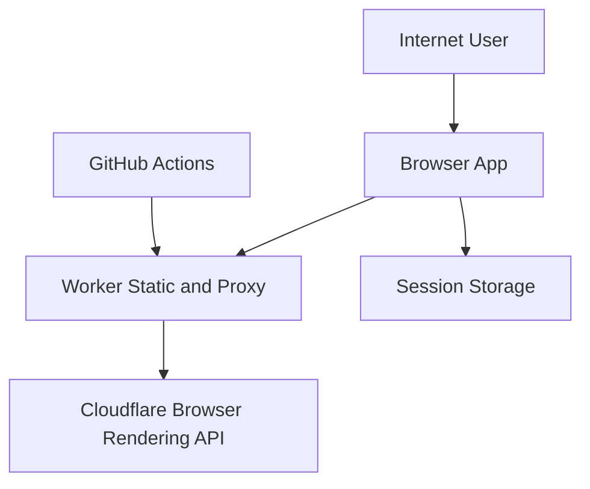

## Assumption-validation check-in
- The app is intended as an internet-accessible demo/playground for Cloudflare Browser Rendering, not a private internal-only service.
- Authentication to Browser Rendering is token-based (`Authorization: Bearer ...`) entered by end users in the UI.
- The Worker serves both static frontend and API proxy on the same origin.
- The primary sensitive assets are API tokens and request payload contents (including optional `custom_ai.authorization` values).
- Browser clients are untrusted by default; any internet user can reach the deployed Worker URL.

1. Is this deployment intended to be publicly reachable on the internet, or restricted to an internal audience?
2. Do you want to require additional edge access controls (Cloudflare Access/service token) in front of `/api/cf/*`?
3. Are users expected to paste high-sensitivity secrets (for example third-party model keys in `custom_ai.authorization`) into this UI?

Proceeding with a provisional threat model under the assumptions above.

## Executive summary
Top risks center on proxy abuse and token handling. The repository now has solid baseline hardening for browser-origin requests (path/method restrictions, same-origin checks, upstream header allowlist, and security headers), but the proxy remains internet-callable by non-browser clients and can still be abused for cost/availability impact without edge-level rate limiting/access controls. Client-side session storage reduces persistence window versus local storage, but any successful same-origin script compromise would still expose tokens.

## Scope and assumptions
In-scope paths:
- `worker/index.ts`
- `wrangler.toml`
- `src/App.tsx`
- `src/hooks/useLocalStorage.ts`
- `src/lib/buildRequest.ts`
- `src/components/SettingsPanel.tsx`
- `src/components/EndpointForm.tsx`
- `.github/workflows/deploy.yml`

Out-of-scope:
- Cloudflare-managed internals of Browser Rendering API
- Cloudflare account-level IAM configuration outside this repo
- Runtime WAF/rate-limit policies configured only in Cloudflare dashboard

Assumptions:
- Service runs on Cloudflare Workers and is internet-exposed.
- Users provide their own Cloudflare API tokens.
- TLS is handled by Cloudflare edge.

Open questions that could change risk ranking:
- Whether additional edge auth/rate limits already exist outside repo.
- Whether deployment is single-tenant personal use or multi-user shared service.

## System model
### Primary components
- React SPA frontend rendered from Worker static assets (`worker/index.ts`, `src/App.tsx`).
- Browser-side request builder and UI state persistence (`src/lib/buildRequest.ts`, `src/hooks/useLocalStorage.ts`).
- Worker API proxy for `/api/cf/*` (`worker/index.ts`).
- External Cloudflare Browser Rendering REST API (`https://api.cloudflare.com/...`).
- CI/CD deployment pipeline with GitHub Actions and Cloudflare token secret (`.github/workflows/deploy.yml`).

### Data flows and trust boundaries
- Internet user browser -> Worker static asset handler
  - Data: HTTP requests for app assets.
  - Channel: HTTPS.
  - Security guarantees: Cloudflare transport security; Worker adds CSP and security headers for HTML (`worker/index.ts:40`, `worker/index.ts:196`).
  - Validation: Asset path lookup and SPA fallback.
- Browser app -> Worker proxy `/api/cf/*`
  - Data: Cloudflare API token, URL/HTML inputs, scraping/injection options, optional model authorization values.
  - Channel: HTTPS same-origin.
  - Security guarantees: method restriction, same-origin browser check, auth/content-type checks (`worker/index.ts:85`, `worker/index.ts:89`, `worker/index.ts:100`, `worker/index.ts:107`).
  - Validation: API path regex enforcement (`worker/index.ts:10`, `worker/index.ts:116`).
- Worker proxy -> Cloudflare API
  - Data: filtered request headers and JSON body.
  - Channel: HTTPS to `api.cloudflare.com`.
  - Security guarantees: explicit target origin constant and header allowlist (`worker/index.ts:11`, `worker/index.ts:122`, `worker/index.ts:147`).
  - Validation: only Browser Rendering paths forwarded.
- Browser runtime -> browser storage
  - Data: account ID, API token, form payloads.
  - Channel: Web Storage API.
  - Security guarantees: session-scoped persistence (`src/App.tsx:15`, `src/hooks/useLocalStorage.ts:5`).
  - Validation: none; data treated as application state.

#### Diagram

## Assets and security objectives
| Asset | Why it matters | Security objective (C/I/A) |
| --- | --- | --- |
| Cloudflare API tokens | Authorize Browser Rendering actions and can incur account cost | C, I |
| Request payloads (URLs, HTML, selectors, custom_ai authorization) | May contain proprietary/sensitive data and third-party credentials | C |
| Worker availability/budget | Abuse can consume Worker invocations and create cost/availability issues | A |
| Proxy routing integrity | Incorrect forwarding could expose broader Cloudflare API surfaces | I |
| Deployment secret (`CLOUDFLARE_API_TOKEN`) | Controls release pipeline and production updates | C, I |

## Attacker model
### Capabilities
- Remote unauthenticated attacker can call the public Worker URL.
- Malicious browser origin can attempt cross-origin API usage.
- Attacker can submit arbitrary URL/HTML payloads through UI if they have valid token.
- Attacker can attempt supply-chain abuse via compromised dependencies or CI context.

### Non-capabilities
- Cannot directly read another origin’s session storage under normal browser same-origin policy.
- Cannot bypass Cloudflare API-side auth requirements without a valid token.
- Cannot directly modify repository or deployment secrets without SCM/CI compromise.

## Entry points and attack surfaces
| Surface | How reached | Trust boundary | Notes | Evidence (repo path / symbol) |
| --- | --- | --- | --- | --- |
| Worker proxy `/api/cf/*` | Internet HTTPS request | Untrusted internet -> Worker | Main runtime attack surface for abuse and input forwarding | `worker/index.ts:23`, `worker/index.ts:84` |
| Proxy path validation | Request path under `/api/cf/*` | Untrusted request -> upstream routing | Restricts to Browser Rendering API paths only | `worker/index.ts:10`, `worker/index.ts:116` |
| Browser credential input | Settings modal | User input -> browser state | API token captured client-side | `src/components/SettingsPanel.tsx:81` |
| Browser storage | App state writes | Runtime script -> persisted state | Session storage contains sensitive request state | `src/App.tsx:15`, `src/hooks/useLocalStorage.ts:5` |
| Request composer | UI form submission | User input -> outbound proxy request | Includes advanced fields, including script injection and custom auth payloads | `src/lib/buildRequest.ts:483`, `src/components/EndpointForm.tsx:368` |
| CI deployment | GitHub push to main | SCM -> production deploy | Uses Cloudflare API token secret | `.github/workflows/deploy.yml:4`, `.github/workflows/deploy.yml:31` |

## Top abuse paths
1. Proxy resource abuse / cost DoS
   1. Attacker scripts direct requests to public `/api/cf/*` endpoint.
   2. Requests pass non-browser allowance (no `Origin`) and consume Worker executions.
   3. Service budget/availability degrades.
2. Token theft via frontend compromise
   1. Attacker gains script execution in app origin (supply chain or injected script).
   2. Script reads session storage keys containing token/form state.
   3. Attacker reuses token to invoke Browser Rendering API.
3. High-volume automated Browser Rendering usage
   1. Attacker obtains any valid token and sends large request volume through proxy.
   2. Upstream executes expensive browser sessions.
   3. Cost and rate-limit exhaustion impacts legitimate users.
4. Deployment pipeline compromise path
   1. Attacker compromises maintainer account or CI context.
   2. Malicious commit triggers auto-deploy from `main`.
   3. Production Worker serves hostile code to users.
5. Sensitive payload exposure in local runtime
   1. User pastes third-party model auth (`custom_ai.authorization`) into form.
   2. Value is retained in session storage and visible to any same-origin script.
   3. Credential leakage enables external model/account abuse.

## Threat model table
| Threat ID | Threat source | Prerequisites | Threat action | Impact | Impacted assets | Existing controls (evidence) | Gaps | Recommended mitigations | Detection ideas | Likelihood | Impact severity | Priority |
| --- | --- | --- | --- | --- | --- | --- | --- | --- | --- | --- | --- | --- |
| TM-001 | Internet attacker | Public Worker URL reachable; no edge ACL/rate-limit outside repo | Flood `/api/cf/*` with direct non-browser traffic | Worker cost increase and availability degradation | Worker availability/budget | Method/path/auth/content-type checks (`worker/index.ts:85`, `worker/index.ts:116`, `worker/index.ts:100`) | No built-in rate limit or access gate for non-browser clients (`worker/index.ts:170`) | Add Cloudflare rate limiting/WAF rules; for private use, gate `/api/cf/*` with Cloudflare Access/service token | Alert on request rate spikes by path and IP; track 4xx/5xx ratios | medium | medium | medium |
| TM-002 | Same-origin script attacker | XSS or third-party script compromise in app origin | Read session storage and exfiltrate API token/form payloads | Token misuse and data exposure | API tokens, request payloads | Session (not local) persistence reduces lifetime (`src/App.tsx:15`); CSP baseline on HTML (`worker/index.ts:207`) | Tokens still readable by JS in runtime | Add optional “in-memory only” token mode; avoid storing sensitive form fields; strict dependency governance | Detect unusual token usage patterns in Cloudflare audit logs | low | high | medium |
| TM-003 | Malicious cross-origin web page | Victim browser visits attacker page | Attempt browser CORS abuse against proxy | Unauthorized browser-side use of proxy | Proxy routing integrity | Same-origin browser check + scoped CORS (`worker/index.ts:89`, `worker/index.ts:215`) | Server-to-server callers still possible | Keep same-origin enforcement; combine with edge rate limiting and bot controls | Monitor blocked origin mismatches (403) | low | medium | low |
| TM-004 | SCM/CI attacker | Compromised maintainer or CI secret exposure | Push malicious code to `main` and auto-deploy | Full frontend compromise and credential theft | Deployment integrity, tokens | CI uses GitHub secret for deploy (`.github/workflows/deploy.yml:31`) | No branch protection/policy evidence in repo | Enforce branch protection, required reviews, and signed commits; scope Cloudflare deploy token minimally | Alert on unusual deploy actor, frequency, or token usage | low | high | medium |
| TM-005 | Authenticated malicious user | Valid token and access to app UI | Use advanced payload options to run large/abusive extraction jobs | Upstream quota exhaustion and possible third-party abuse | Cloudflare API budget, third-party model credentials | Request construction is explicit and encoded (`src/lib/buildRequest.ts:488`) | No per-user quota or policy controls at app layer | Add tenant/user usage policy for shared deployments; reject risky payload profiles if needed | Track high-cost endpoint usage and unusual payload patterns | medium | medium | medium |

## Criticality calibration
- `critical` in this repo/context:
  - Compromise enabling arbitrary script execution in delivered frontend at scale.
  - Full loss of deploy integrity with malicious production rollout and token harvesting.
- `high` in this repo/context:
  - Reliable token exfiltration leading to broad account abuse.
  - Unbounded proxy abuse causing sustained outage/cost incidents.
- `medium` in this repo/context:
  - Practical resource abuse requiring attacker effort but no privileged access.
  - Conditional secret exposure requiring additional precondition (same-origin script execution).
- `low` in this repo/context:
  - Cross-origin browser attempts already blocked by same-origin checks.
  - Hardening gaps with limited direct exploitability under current controls.

## Focus paths for security review
| Path | Why it matters | Related Threat IDs |
| --- | --- | --- |
| `worker/index.ts` | Core trust boundary enforcement, proxy controls, and response security headers | TM-001, TM-003, TM-005 |
| `src/hooks/useLocalStorage.ts` | Determines lifetime and exposure of sensitive client state | TM-002 |
| `src/App.tsx` | Binds sensitive settings/form state to browser persistence and request flow | TM-002, TM-005 |
| `src/lib/buildRequest.ts` | Constructs outbound API paths/headers/body that cross trust boundaries | TM-005 |
| `src/components/SettingsPanel.tsx` | API token entry UX and user security expectations | TM-002 |
| `src/components/EndpointForm.tsx` | Accepts attacker-controlled high-entropy input and advanced payload options | TM-005 |
| `.github/workflows/deploy.yml` | CI/CD release trust path and deployment credential usage | TM-004 |
| `wrangler.toml` | Runtime deployment shape and potential policy integration point | TM-001 |

## Quality check
- Entry points covered: yes (`/api/cf/*`, settings/token input, form payload construction, CI deploy path).
- Trust boundaries covered in threats: yes (browser->worker, worker->Cloudflare API, browser storage, SCM->deploy).
- Runtime vs CI/dev separation: yes (runtime in Worker/frontend sections; CI in TM-004).
- User clarifications reflected: pending; assumptions listed and targeted questions included above.
- Assumptions and open questions explicit: yes.
